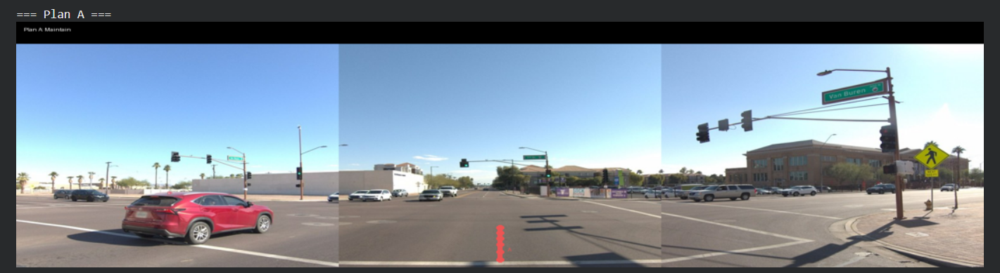
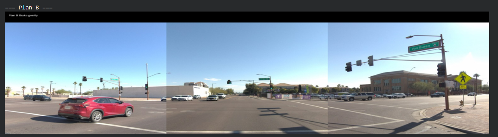
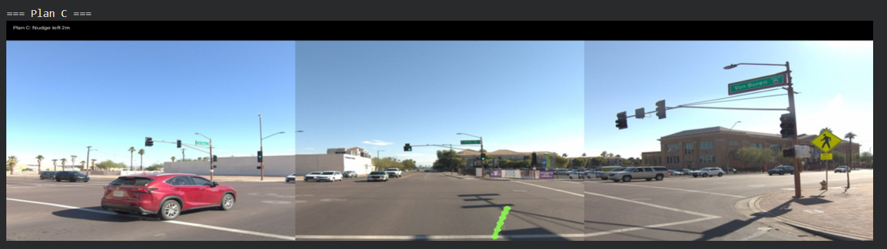
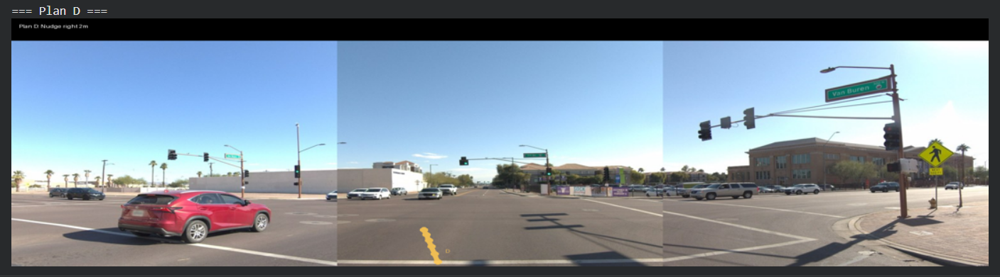
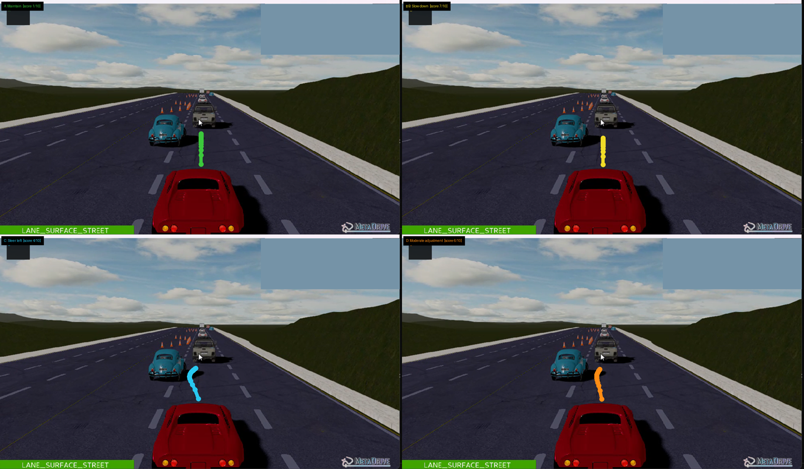

# Visual Counterfactual Critique — A Frozen-VLM Approach to Long-Tail Driving

**SoTA Commission I submission · Abhiraj Rananajay Singh · May 2026**

A multi-agent prompt scaffold over a single frozen 7B vision-language model that achieves **8.02 RFS** on a stratified WOD-E2E sample with **no AV gradient updates, no fine-tuning, and $0 inference cost** — within 0.03 RFS of fine-tuned 2025 SoTA (Poutine, the Waymo Vision-based End-to-End Driving Challenge 2025 winner).

The novel piece: the same VLM that proposes candidate trajectories also **visually critiques renderings of its own actions** as colored polylines projected onto the camera image.

---

## Headline result

| System | RFS | n |
| --- | ---: | ---: |
| Constant velocity (full validation) | 7.00 | 479 |
| Constant velocity (sample22, CV > 5 stratum) | 8.14 | 22 |
| V1 — Qwen-VL + kinematic, single-pass | 7.78 | 22 |
| V3 — V1 + CLIP retrieval (k=3 exemplars) | 7.78 | 22 |
| **Socratic Driver (this work)** | **8.02** | **22** |
| *Poutine (fine-tuned, Waymo Challenge 2025 winner)* | *7.99* | *full* |

The headline finding is documented in detail in `02_socratic_driver_path_x.ipynb` and in the writeup. Briefly: a selection-rule ablation reveals that **the critic's most confident picks are anti-correlated with downstream correctness** — wins-vs-V1 had average critic margin +0.83 over Maintain, losses-vs-V1 had margin +1.75. The visual critic has a real ceiling, and characterizing that ceiling is the central scientific contribution.

---

## Architecture

```
camera frame + ego state
        │
        ▼
┌────────────────────┐
│ 1. Perception      │   Qwen → free-text scene description
└────────────────────┘
        │
        ▼
┌────────────────────┐
│ 2. Planner         │   Qwen → 4 structurally distinct plans (A/B/C/D)
└────────────────────┘
        │
        ▼
┌────────────────────┐
│ 3. Renderer        │   Project each trajectory as a colored polyline
│                    │   (no learned weights — calibrated pinhole)
└────────────────────┘
        │
        ▼
┌────────────────────┐
│ 4. Critic          │   Qwen sees the original frame + 4 overlays,
│                    │   scores each 1–10, picks one
└────────────────────┘
        │
        ▼
┌────────────────────┐
│ 5. Integrator      │   Kinematic bicycle → 20 waypoints at 4 Hz
└────────────────────┘
```

Steps 3–4 are the novel contribution: the same VLM evaluating renderings of its own proposed actions. Three Qwen calls per segment, full evaluation set on a free Colab T4.

### The pipeline in action

**Waymo segment — same scaffold, real driving frame.** The four candidate trajectories projected onto a stitched front-3 camera image. Plan B (brake gently) appears short because the kinematic integrator decelerates the ego sharply over the 5-second horizon — physically correct, not a rendering artifact.

| | |
|:---:|:---:|
|  |  |
|  |  |

**MetaDrive cross-domain replication.** Same frozen weights, same prompts, same renderer — applied to a synthetic construction-zone frame from the simulator deliverable. Critic scores shown badged on each quadrant; the chosen plan is starred. The anti-correlation pattern reproduces: perception correctly identified that the *left lane is clear* (so Plan C should win), but the critic chose Plan B (slow down) instead.



---

## Declaration of base models and data

**Models (all open-weights, frozen, downloaded from public HuggingFace mirrors):**

| Component | Model | Source | Modification |
| --- | --- | --- | --- |
| Perception, Planner, Critic | `Qwen/Qwen2.5-VL-7B-Instruct` | HuggingFace | None (4-bit NF4 quantization at load time via `bitsandbytes`; weights are not retrained) |
| Visual retrieval (V3 baseline only) | `open_clip` `ViT-B-32` (`laion2b_s34b_b79k`) | HuggingFace | None |
| WOD-E2E metric implementation | `rater_feedback_utils` from `waymo-research/waymo-open-dataset` | GitHub `master` | None (binary copy from upstream — file is missing from the released wheel) |

**No fine-tuning, no LoRA, no adapter training, no RLHF, no domain adaptation.** Every weight that participates in inference was downloaded as-is from the source listed above.

**Data:**

| Use | Dataset | License | Used for |
| --- | --- | --- | --- |
| Evaluation only | Waymo Open Dataset for End-to-End Driving v1.0 (validation split) | Waymo Open Dataset License Agreement for Non-Commercial Use | RFS scoring against 22-segment stratified sample |
| Evaluation only | MetaDrive procedural scenarios | Apache 2.0 | Cross-domain Prometheus extension figure |

**No AV gradient updates touched WOD-E2E, nuScenes, CoVLA, Argoverse, KITTI, or Waymo Motion at any point in this submission.**

---

## Repository layout

```
SoTA_Commission/
├── README.md                              ← this file
├── writeup/
│   └── SoTA_Commission_Write_up.pdf       ← 2-page writeup
├── notebooks/
│   ├── 01_exploration_path_y.ipynb        ← exploration: Gemini, V1, V3, retrieval
│   └── 02_socratic_driver_path_x.ipynb    ← final Socratic Driver pipeline
├── sim/
│   ├── record_scenarios.py                ← MetaDrive long-tail scenario recorder
│   ├── sim1.mp4                           ← highway dense-traffic
│   ├── sim3.mp4                           ← traffic cut-ins
│   └── sim5.mp4                           ← construction-cone obstacle scenario
├── prometheus/
│   ├── cross_domain_metadrive.ipynb       ← run Socratic Driver on a MetaDrive frame
│   ├── metadrive_construction.png         ← input frame (cropped from sim5)
│   ├── metadrive_socratic_overlays.png    ← cross-domain figure (2×2 grid of overlays)
│   └── metadrive_socratic_results.json    ← full replay trace
├── outputs/                               ← cached results from notebook runs
│   ├── socratic_results.csv
│   ├── socratic_traces.pkl                ← all 22 multi-agent traces, replayable
│   ├── HEADLINE_RESULTS.csv
│   ├── SELECTION_RULE_ABLATION.csv
│   ├── CRITIC_CONFIDENCE_ANALYSIS.csv
│   ├── v1_qwen_results_fixed.csv
│   ├── v3_qwen_results.csv
│   └── cv_all_479.npy                     ← constant-velocity RFS over full val
└── data/
    └── sample22_v2.json                   ← 22-segment evaluation stratum
```

---

## Reproducibility

### Path A — run the analysis notebooks (recommended for judges)

The two notebooks are **runnable end-to-end on free Colab with a T4 GPU**. They handle all installs, data download, model load, and figure generation themselves.

1. Open `notebooks/02_socratic_driver_path_x.ipynb` in Colab.
2. `Runtime → Change runtime type → T4 GPU`.
3. `Runtime → Run all`. Total wall-clock ~45 minutes (mostly Qwen inference on 22 segments).
4. The headline 8.02 RFS, the ablation table, and per-segment traces will materialize into `outputs/`.

The exploration notebook `01_exploration_path_y.ipynb` documents Path Y in chronological order (Gemini API attempts, V1 baseline, the kinematic-integrator bug, V3 retrieval) and is the answer to *"how findings shaped the final system"* in the brief.

### Path B — local MetaDrive simulator environment

The simulator deliverable runs locally on Windows / Linux / macOS. It is **separate from the Colab analysis pipeline** — you only need this if you want to regenerate the MetaDrive scenario clips or re-run the Prometheus cross-domain figure.

**Tested with Python 3.8 on Windows 11 with a 4 GB consumer GPU.**

```powershell
# Create a fresh Python 3.8 venv (the project was developed against 3.8)
python3.8 -m venv metadrive-env
.\metadrive-env\Scripts\activate          # Windows PowerShell
# source metadrive-env/bin/activate       # Linux / macOS

# Install MetaDrive + recording deps
pip install metadrive-simulator==0.4.3 imageio imageio-ffmpeg pillow --default-timeout=180
```

The first MetaDrive launch will auto-download the asset bundle (~700 MB) into `<venv>/lib/site-packages/metadrive/assets/`. This takes ~3 minutes on a typical connection.

**Smoke tests**

Headless (no window):

```powershell
python -c "from metadrive.envs.metadrive_env import MetaDriveEnv; e = MetaDriveEnv({'use_render': False, 'num_scenarios': 1}); o, _ = e.reset(); [e.step([0, 0.5]) for _ in range(50)]; print('OK headless'); e.close()"
```

Windowed (3D chase-cam, what you see in the demo clips):

```powershell
python -c "from metadrive.envs.metadrive_env import MetaDriveEnv; e = MetaDriveEnv({'use_render': True, 'num_scenarios': 1, 'window_size': (800, 600)}); o, _ = e.reset(); [e.step([0, 0.3]) for _ in range(300)]; e.close()"
```

**Record the 3 long-tail scenarios:**

```powershell
python sim/record_scenarios.py
```

The script walks you through 5 scenarios interactively (highway dense-traffic, curvy roads, traffic cut-ins, intersections, and the construction-cone obstacle scenario via `SafeMetaDriveEnv` with `accident_prob=1.0`). For each scenario, you press Enter to launch a windowed run and use Windows Snipping Tool video mode (`Win + Shift + S` → switch to video) or a similar screen recorder to capture the window.

The repository ships the 3 cleanest clips (`sim1.mp4`, `sim3.mp4`, `sim5.mp4`); the script regenerates all 5 from scratch if you want the full set. Curated rather than complete because the numpy expert occasionally wandered off-road on the curvy and intersection runs — installing PyTorch CPU as below switches MetaDrive to its stronger expert and avoids that.

**Optional but recommended:** install PyTorch CPU.

```powershell
pip install torch --index-url https://download.pytorch.org/whl/cpu
```

### Path C — Prometheus cross-domain figure

Reproduces the cross-domain replication described in the writeup. Runs on free Colab T4 in ~3 minutes after the Qwen model is already loaded.

`prometheus/cross_domain_metadrive.ipynb` is included as a **reference notebook with the expected output cells** — it shows what the perception, planner, overlay rendering, and critic stages should produce on a synthetic frame. To regenerate the figure yourself:

1. Open `notebooks/02_socratic_driver_path_x.ipynb` in Colab and run cells 0, 1, 3, 9, 13, 20 in order. This sets up the drive mount, installs `bitsandbytes` + `qwen-vl-utils`, loads Qwen2.5-VL-7B at 4-bit, and defines `qwen_chat`, `perceive_socratic`, `propose_plans_socratic`, the critic, and the renderer. (Do not `Run all` — those specific cells are enough; the rest evaluates Waymo and is unrelated to the cross-domain figure.)
2. Upload `prometheus/metadrive_construction.png` to `/content/` in the same Colab session.
3. Open `prometheus/cross_domain_metadrive.ipynb` in another tab, copy the code cells from it, and paste them as new cells at the bottom of the running `02_socratic_driver_path_x.ipynb` notebook. Run them.
4. Outputs: `/content/metadrive_socratic_overlays.png` (the 2×2 deck figure) and `/content/metadrive_socratic_results.json` (full trace). Right-click → download from the Colab file browser.

---

## Key files 

If you only have 5 minutes:

1. **`writeup/SoTA_Commission_Write_up.pdf`** — 2-page summary of motivation, architecture, results, and the anti-correlation finding.
2. **`prometheus/metadrive_socratic_overlays.png`** — the cross-domain figure.
3. **`outputs/HEADLINE_RESULTS.csv`** — the headline 8.02 number with all baselines.
4. **`outputs/SELECTION_RULE_ABLATION.csv`** — the anti-correlation ablation.

If you have more:

5. **`notebooks/02_socratic_driver_path_x.ipynb`** — read top to bottom. The narrative markdown cells explain why each design choice was made.

6. **`notebooks/01_exploration_path_y.ipynb`** — the exploration phase. Documents the Gemini API attempts, the V1 baseline, the kinematic-integrator bug that cost ~4% in RFS until found, the V3 CLIP retrieval that added literally zero RFS, and the realization that drove the Socratic design.

---

## Limitations and honest caveats

- **Sample size is small (n=22).** The CV>5 stratification is principled but the absolute count is low. Confidence intervals on RFS differences of 0.24 are wide.
- **The 7B critic is weak relative to 70B+ frontier models.** Whether the anti-correlation finding survives a 72B Qwen or GPT-4V is an open question (and one of the three prongs the prize money would fund).
- **Critic is a single-pass scorer with no calibration.** A confidence-aware aggregator across multiple critic prompts is plausible future work.


---

## Contact

Abhiraj Rananajay Singh — see GitHub profile for contact.

For questions about this submission specifically: open an issue on this repository.
